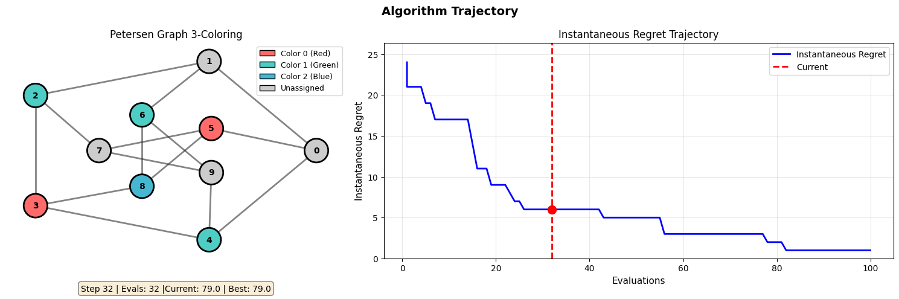

# Regret - A Benchmarking Framework for Black-Box Combinatorial Optimisation

> *Studying regret-based analysis as an empirical alternative to Drift Analysis for black-box optimisation algorithms on pseudo-boolean and combinatorial problems.*

---


## Motivation & Research Context

Classical theoretical analysis of randomised search heuristics has long relied on **Drift Analysis** (Lengler, 2018) - a mathematical framework that bounds expected hitting times by studying how much an algorithm "drifts" towards the optimum per step. While this practice is standard, drift analysis is:

- Difficult to apply empirically across diverse problem landscapes;
- Primarily suited to convergence-time arguments rather than characterising *quality* of intermediate solutions.
- A good indicator of bounds to sample (or 'drift' toward) the optimum;
  however, it does not provide information on the asymptotic performance of the algorithm

This project investigates whether **regret**, a metric borrowed from reinforcement learning (utilized in online learning and bandits), can serve as a practical, empirically-grounded alternative for characterising algorithm behaviour across the same domain. Three forms of regret are tracked:

| Regret Type | Definition |
| --- | --- |
| **Simple Regret** | `f* − f(best)` at the end of a budget |
| **Instantaneous Regret** | `f* − f(x_t)` at each evaluation step `t` |
| **Cumulative Regret** | Running integral of instantaneous regret over time |

The domain of analysis for this project: **binary combinatorial black-box optimisation** over inputs from `{0, 1}^n`, where objective function evaluations are the primary cost. All optimisation problems are **maximising**.

### Algorithms Under Study

The algorithms studied are those whose theoretical behaviour is well-characterised by drift analysis, making them natural comparison targets:

- **RLS** - Randomised Local Search (stochastic hill climber, 1-bit flip);
- **RLSExploration** - RLS augmented with an ε-greedy random restart mechanism;
- **(1+1)-EA** - Evolutionary algorithm with standard bit mutation at rate `1/n`;
- **(μ+λ)-EA** - Generalised evolutionary strategy with configurable population sizes (no crossover);
- **Simulated Annealing** - With logarithmic, linear, and exponential cooling schedules.

---

## Prerequisites

- **Python** ≥ 3.12 (see `.python-version`)
- **[uv](https://docs.astral.sh/uv/)** - recommended package manager

Install dependencies:

```bash
uv sync
```

Or with pip:

```bash
pip install -e .
```

Core dependencies: `numpy`, `scipy`, `matplotlib`, `pandas`, `pyyaml`, `jsonschema`, `tqdm`, `typer`, `networkx`.  
Jupyter support: `jupyter`, `ipykernel`, `ipympl`, `ipywidgets`.

---

## Development & Testing

The project uses [`just`](https://github.com/casey/just) for common development tasks. Key commands:

```bash
# Type checking
just tc                    # Full type check with ty
just type-check-concise    # One diagnostic per line
just type-check-watch      # Watch mode - rechecks on file changes

# Testing
just test                  # Run all tests
just test tests/test_algorithms.py              # Run specific test file
just test tests/test_algorithms.py::TestRLS     # Run specific test class
just pdb tests/test_algorithms.py               # Run with debugger on failure

# Quality assurance
just qa                    # Full QA suite: format + lint + type-check + test
just coverage              # Run tests with coverage report

# Documentation
just docs-serve            # Serve docs locally with live reload
just docs-build            # Build docs (strict mode)

# Utilities
just clean                 # Remove build/test artifacts
just build                 # Build package for distribution
```

For a full list of available commands, run:

```bash
just --list
```

---

## Usage

All experiments are driven through a single CLI entry point:

```bash
run_experiment <command> <config.yml> [<config2.yml> ...]
```

Or equivalently:

```bash
python -m regret <command> <config.yml> [<config2.yml> ...]
```

### Commands

| Command | Description |
| --- | --- |
| `validate <config...>` | Parse and validate one or more YAML configs without running anything |
| `plan <config...>` | Print dry-run summaries: problem/algorithm combinations, total runs, budgets |
| `run <config...> [--no-plot]` | Execute one or more experiment configs and optionally skip plot generation |
| `analyze <config...>` | Regenerate plots from previously saved JSON results for one or more configs |
| `table <config...> [--format latex\|csv\|markdown]` | Generate summary tables from existing results; defaults to LaTeX format |

### Example

```bash
# Validate one config
run_experiment validate configs/experiments/01_baseline.yml

# Validate multiple configs in sequence
run_experiment validate configs/experiments/01_baseline.yml configs/experiments/02_extended.yml

# Preview execution plan
run_experiment plan configs/experiments/01_baseline.yml

# Run full experiment suites for multiple configs
run_experiment run configs/experiments/01_baseline.yml configs/experiments/02_extended.yml

# Run while skipping plot generation
run_experiment run configs/experiments/01_baseline.yml --no-plot

# Regenerate plots only (no re-running)
run_experiment analyze configs/experiments/01_baseline.yml

# Generate summary tables in LaTeX format (default)
run_experiment table configs/experiments/01_baseline.yml

# Generate summary tables in CSV format
run_experiment table configs/experiments/01_baseline.yml --format csv

# Generate summary tables in Markdown format
run_experiment table configs/experiments/01_baseline.yml --format markdown
```

---

## Project Structure

```bash
regret/
├── configs/
│   └── experiments/
│       ├── 01_baseline.yml               # Core pseudo-boolean benchmark suite
│       ├── 02_extended.yml               # Extended suite: combinatorial + NK landscapes
│       ├── 03_nk_landscape.yml           # NK landscape exploration
│       ├── 04_trap_mutation.yml          # Mutation rate analysis on Trap
│       ├── 05_jump_mutation.yml          # Mutation rate analysis on Jump
│       └── ...                           # Additional experiment suites
│
├── results/
│   ├── raw/                              # JSON output from each experiment run
│   └── figures/                          # Generated PDF plots, organised by suite/problem/n
│
└── src/regret/
    ├── cli.py                            # Typer CLI entry point (single or multi-config)
    ├── _types.py                         # Centralized type aliases and TypedDicts
    ├── _registry.py                      # PROBLEM_REGISTRY, ALGORITHM_REGISTRY, COOLING_REGISTRY
    │
    ├── core/
    │   ├── base.py                       # Abstract base classes: Problem, Algorithm
    │   └── metrics.py                    # Regret computations, trajectory helpers
    │
    ├── problems/
    │   ├── pseudo_boolean.py             # OneMax, LeadingOnes, Jump, TwoMax, BinVal, Trap, Plateau, HIFF
    │   ├── combinatorial.py              # MaxkSAT, PetersenColoringMaxSAT
    │   └── landscapes.py                 # NKLandscape
    │
    ├── algorithms/
    │   ├── local_search.py               # RLS, RLSExploration
    │   ├── evolutionary.py               # OnePlusOneEA, MuPlusLambdaEA
    │   └── annealing.py                  # SimulatedAnnealing + cooling schedules
    │
    ├── analysis/
    │   ├── plotting.py                   # All matplotlib-based plot functions
    │   ├── statistics.py                 # Mann-Whitney U, Wilcoxon, Cohen's d, bootstrap CI
    │   └── tables.py                     # Summary tables + LaTeX/CSV/Markdown export
    │
    ├── gui/
    │   └── ...                           # Interactive trajectory visualization tools
    │
    └── experiments/
        ├── schema.py                     # JSON Schema definition for YAML configs
        ├── validation.py                 # Schema + semantic validation pipeline
        ├── orchestration.py              # Execution planning and dispatch
        ├── runner.py                     # ExperimentRunner (serial/parallel), result persistence
        └── utils.py                      # Config parsing, slug generation, plot dispatch
```

---

## Configuration Pipeline

Experiments are fully specified via YAML files. The pipeline is:

```
YAML File -> load_config -> validate_schema (JSON Schema) -> validate_semantic (registry checks) -> parse_problems / parse_algorithms -> execute / generate_plots
```

### Config Structure

```yaml
suite:
  name: "my_experiment"
  runs: 50                        # Independent runs per (algorithm, problem, budget) triple
  mode: "full"                    # "full" saves trajectories; "lite" saves stats only
  parallel: true                  # Enable parallel execution with ProcessPoolExecutor
  profile: false                  # Enable runtime profiles for intermediate fitness levels 
  budgets: [200, 400, ..., 2000]
  output:
    raw_root: "results/raw"
    figures_root: "results/figures"

problems:
  - name: "Jump-3"
    class: "Jump"                 # Must be in PROBLEM_REGISTRY
    budget_for_plots: 2000        # Budget to use for per-budget plots (optional)
    params:
      n: 100
      k: 3

algorithms:
  - name: "SA-Log"
    class: "SimulatedAnnealing"   # Must be in ALGORITHM_REGISTRY
    args:
      defaults:
        T_func:
          type: "logarithmic"     # Must be in COOLING_REGISTRY
          params:
            d: 2.0
      by_problem:                 # Per-problem parameter overrides
        Jump-3:
          T_func:
            type: "logarithmic"
            params:
              d: 6.0

plotting:
  enabled: true
  plots:
    regret_instantaneous:
      enabled: true
      filename: "history_regret_instantaneous.pdf"
      series: "instantaneous"
      track_incumbent: false      # Use current solution value at each step
      log_y: true
    
    regret_instantaneous_best:
      enabled: true
      filename: "history_regret_instantaneous_best.pdf"
      series: "instantaneous"
      track_incumbent: true       # Use best-so-far (incumbent) value at each step
      log_y: true
    # ... (see configs/ for full reference)
```

#### Regret Computation: `track_incumbent` Parameter

The `track_incumbent` parameter controls which solution value is used when computing regret at each evaluation step:

- **`track_incumbent: false`** (default) - Use the **current solution** value at time `t`:
  - Regret = `f* - f(x_t)`
  - Shows how far the *current* solution is from optimal
  - Reflects exploration behavior and temporary degradations

- **`track_incumbent: true`** - Use the **best-so-far (incumbent)** value up to time `t`:
  - Regret = `f* - f(best_t)`
  - Shows how far the *best solution found so far* is from optimal
  - Equivalent to simple regret trajectory over time
  - Monotonically non-increasing for maximization problems

**Plot naming convention:** Plots with `_best` suffix use `track_incumbent: true` by default; others default to `false`.

### Key Design Decisions

**Registry pattern.** Problems and algorithms are registered by string name in `experiments/__init__.py`. This allows YAML configs to reference classes symbolically, and the validation layer catches typos before any computation begins.

**Schema-first validation.** A JSON Schema (`schema.py`) is checked before any semantic validation. This provides clear, structured error messages for malformed configs independent of Python exceptions.

**`defaults` + `by_problem` merging.** Algorithm arguments support a two-level override system: `defaults` apply to all problems, and `by_problem` keys override them per problem using a deep merge. This makes it easy to tune SA cooling schedules or RLSExploration epsilon values for rugged landscapes without duplicating algorithm entries.

**`mode: full` vs `mode: lite`.** In `full` mode, every step of every run is recorded as a `(evaluations, current_value, best_value)` trajectory tuple. This enables instantaneous and cumulative regret plots and TTFO analysis but increases storage significantly. In `lite` mode, only final statistics are saved, which can be suitable for large-scale sweeps.

**Parallel execution.** When `parallel: true`, each independent run is dispatched via `ProcessPoolExecutor`. Seeds are fixed per run index (0, 1, ..., runs-1), ensuring full reproducibility.

**Cooling schedule resolution.** SA cooling schedules are specified declaratively in YAML and resolved at runtime via `resolve_cooling()` in `utils.py`. Supported types: `logarithmic` (T = d/log(t+1)), `linear`, and `exponential`.

**TTFO markers.** All history and regret plots optionally overlay a "time to first optimum" marker, a vertical dotted line at the mean TTFO across runs, with a point on the mean curve. This provides visual alignment between convergence speed and the regret trajectory.

---

## Combinatorial Problems Analysed

| Name | Class | Description | Optimum |
| --- | --- | --- | --- |
| OneMax | `OneMax` | Count of ones | n |
| LeadingOnes | `LeadingOnes` | Length of leading-ones prefix | n |
| TwoMax | `TwoMax` | max(ones, zeros) - bioptimal (symmetrical optimum analysis) | n |
| Jump-k | `Jump` | OneMax with a deceptive valley of width k | n |
| Trap-k | `Trap` | Fully deceptive; gradient points away from optimum | n |
| BinVal | `BinVal` | Exponentially weighted binary value | 2^n − 1 |
| Plateau-k | `Plateau` | OneMax with a flat plateau near the top | n |
| HIFF | `HIFF` | Hierarchical if-and-only-if (n must be power of 2) | n·(log₂n + 1) |
| MaxkSAT | `MaxkSAT` | Random k-SAT clause satisfaction (maximisation) | m (all clauses) |
| PetersenColoringMaxSAT | `PetersenColoringMaxSAT` | 3-coloring MaxSAT on Petersen graph (specialized) | 15 clauses |
| NK-k | `NKLandscape` | Tunable-ruggedness fitness landscape | exhaustive search (n <= 20) |

---

## Output & Plots

Results are stored as structured JSON under `results/raw/<suite>/<problem>/<algorithm>/n<N>/b<budget>.json`, containing metadata, summary statistics, and (in `full` mode) per-run trajectories.

Figures are written to `results/figures/<suite>/<problem>/n<N>/` and organised into subdirectories:

- `aggregate/` - regret curves, convergence probability, comparison heatmap;
- `budget_<B>/` - boxplots and performance profiles at a specific budget;
- `history/` - value trajectories, instantaneous/cumulative regret curves, TTFO distribution.

All figures are saved as PDF at 300 DPI.

---

## References

- Lengler, J. (2018). *Drift Analysis*. [https://doi.org/10.48550/arXiv.1712.00964](https://doi.org/10.48550/arXiv.1712.00964)
